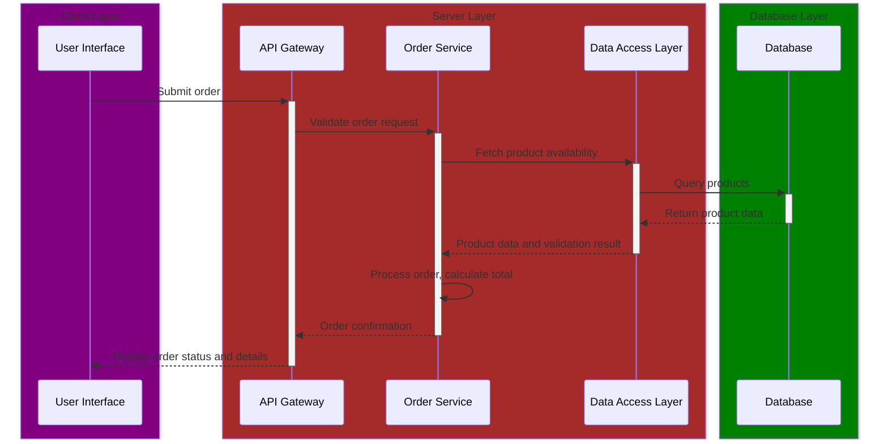

```mermaid
sequenceDiagram

    box purple Client Layer
    participant UI as User Interface
    end
    box brown Server Layer
    participant Gateway as API Gateway
    participant Service as Order Service
    participant DAL as Data Access Layer
    end
    box green Database Layer
    participant DB as Database
    end

    UI->>+Gateway: Submit order
    Gateway->>+Service: Validate order request
    Service->>+DAL: Fetch product availability
    DAL->>+DB: Query products
    DB-->>-DAL: Return product data
    DAL-->>-Service: Product data and validation result
    Service->>Service: Process order, calculate total
    Service-->>-Gateway: Order confirmation
    Gateway-->>-UI: Display order status and details
```
